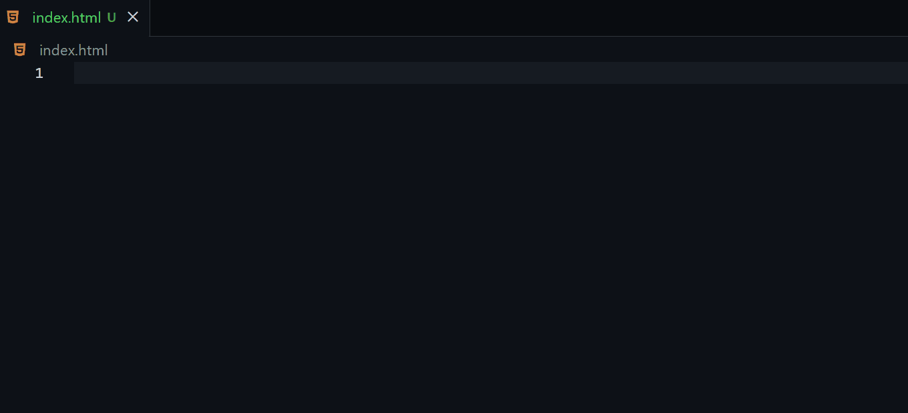

# bootstrap-5-snippets-extension

---
## Features

More than **150** useful Bootstrap 5 snippets added.

## Snippets

| Named                       | Snippet                     |
|-----------------------------|-----------------------------|
| CDN                         | b5-$                        |
| Grid Default                | b5-grid-default             |
| Container                   | b5-grid-container           |
| Container Fluid             | b5-grid-container-fluid     |
| Row                         | b5-grid-row                 |
| Column                      | b5-grid-col                 |
| Gutters                     | b5-gutters                  |
| Horizontal Gutters          | b5-gutters-x                |
| Vertical Gutters            | b5-gutters-y                |
| Table Default               | b5-table-default            |
| Table Custom                | b5-table-custom             |
| Image Fluid                 | b5-img-fluid                |
| Image Thumbnail             | b5-img-thumbnail            |
| Email Form                  | b5-form-email               |
| Password Form               | b5-form-pass                |
| Text Form                   | b5-form-text                |
| Disabled Form               | b5-form-disable             |
| Readonly Form               | b5-form-readonly            |
| Textarea Form               | b5-form-textarea            |
| File Input                  | b5-form-file                |
| Color Picker                | b5-form-color               |
| Datalist                    | b5-form-datalist            |
| Select Default              | b5-select-default           |
| Select Size                 | b5-select-size              |
| Select Multiple             | b5-select-multiple          |
| Select Disable              | b5-select-disable           |
| Checkbox Default            | b5-checkbox-default         |
| Checkbox Default Checked    | b5-checkbox-default-check   |
| Checkbox Indeterminate      | b5-checkbox-indeterminate   |
| Checkbox Disabled Unchecked | b5-checkbox-disable-uncheck |
| Checkbox Disabled Checked   | b5-checkbox-disable-check   |
| Radio Default               | b5-radio-default            |
| Radio Default Checked       | b5-radio-default-check      |
| Radio Disabled              | b5-radio-disable            |
| Radio Disabled Checked      | b5-radio-disable-check      |
| Switch Default              | b5-switch-default           |
| Switch Checked              | b5-switch-check             |
| Switch Disabled             | b5-switch-disable           |
| Switch Disabled Checked     | b5-switch-disable-check     |
| Checkbox Inline             | b5-checkbox-inline          |
| Radio Inline                | b5-radio-inline             |
| Checkbox no Label           | b5-checkbox-nolabel         |
| Radio no Label              | b5-radio-nolabel            |
| Range                       | b5-range                    |
| Range Disable               | b5-range-disable            |
| Range Min Max               | b5-range-minmax             |
| Range Steps                 | b5-range-steps              |
| Addon Size Default          | b5-addon-default            |
| Addon Size                  | b5-addon-size               |
| Addon Checkbox              | b5-addon-checkbox           |
| Addon Radio                 | b5-addon-radio              |
| Addon Multiple Input        | b5-addon-multi-input        |
| Addon Multiple Start        | b5-addon-multi-start        |
| Addon Multiple End          | b5-addon-multi-end          |
| Addon Button Start          | b5-addon-btn-start          |
| Addon Button End            | b5-addon-btn-end            |
| Addon Dropdown Start        | b5-addon-dropdwn-start      |
| Addon Dropdown End          | b5-addon-dropdwn-end        |
| Addon Dropdown Sides        | b5-addon-dropdwn-sides      |
| Segmented Buttons Start     | b5-segment-btn-start        |
| Segmented Buttons End       | b5-segment-btn-end          |
| Custom Select Label         | b5-custom-select-label      |
| Custom Select Button        | b5-custom-select-btn        |
| Custom File Input Label     | b5-custom-file-label        |
| Custom File Input Button    | b5-custom-file-btn          |
| Floating Label Form         | b5-form-float-label         |
| Floating Label Invalid Form | b5-form-float-label-invalid |
| Floating Textarea Form      | b5-form-float-textarea      |
| Floating Select             | b5-form-float-select        |
| Accordion Close             | b5-accordion-close          |
| Accordion Open              | b5-accordion-open           |
| Alert                       | b5-alert                    |
| Alert Link                  | b5-alert-link               |
| Alert Content               | b5-alert-content            |
| Alert Dismissing            | b5-alert-dismiss            |
| Badge                       | b5-badge                    |
| Badge Button                | b5-badge-button             |
| Badge Positioned Count      | b5-badge-positioned-count   |
| Badge Positioned No Count   | b5-badge-positioned         |
| Breadcrumb                  | b5-breadcrumb               |
| Breadcrumb Divider          | b5-breadcrumb-divider       |
| Buttons                     | b5-button                   |
| Outline Buttons             | b5-outline-button           |
| Button Size                 | b5-button-size              |
| Block Buttons               | b5-button-block             |
| Responsive Block Buttons    | b5-button-block-responsive  |
| Button Group                | b5-button-group             |
| Checkbox Button Group       | b5-checkbox-button-group    |
| Radio Button Group          | b5-radio-button-group       |
| Card                        | b5-card                     |
| Card Image                  | b5-card-image               |
| Card List                   | b5-card-list                |
| Card Navigation Tabs        | b5-card-nav-tab             |
| Card Navigation Pills       | b5-card-nav-pills           |
| Card Image Overlay          | b5-card-image-overlay       |
| Card Horizontal             | b5-card-horizontal          |
| Card Color                  | b5-card-color               |
| Card Border                 | b5-card-border              |
| Card Group                  | b5-card-group               |
| Card Group Footer           | b5-card-group-footer        |
| Card Grid                   | b5-card-grid                |
| Card Grid Footer            | b5-card-grid-footer         |
| Carousel Slide Only         | b5-carousel-slide-only      |
| Carousel Controls           | b5-carousel-controls        |
| Carousel Indicators         | b5-carousel-indicators      |
| Carousel Captions           | b5-carousel-captions        |
| Carousel Crossfade          | b5-carousel-crossfade       |
| Close Button                | b5-close-button             |
| Collapse                    | b5-collapse                 |
| Collapse Multiple           | b5-collapse-multiple        |
| Dropdown Button             | b5-dropdown-button          |
| Dropdown Anchor             | b5-dropdown-anchor          |
| List Group                  | b5-list-group               |
| List Link                   | b5-list-link                |
| List Button                 | b5-list-button              |
| List Flush                  | b5-list-flush               |
| List Numbered               | b5-list-numbered            |
| List Horizontal             | b5-list-horizontal          |
| List Checkbox               | b5-list-checkbox            |
| List Radio                  | b5-list-radio               |
| Modal                       | b5-modal                    |
| Modal Static Backdrop       | b5-modal-static-backdrop    |
| Nav Base                    | b5-nav-base                 |
| Nav                         | b5-nav                      |
| Nav Tab                     | b5-nav-tab                  |
| Nav pill                    | b5-nav-pill                 |
| Navbar                      | b5-navbar                   |
| Offcanvas                   | b5-offcanvas                |
| Pagination                  | b5-pagination               |
| Popover                     | b5-popover                  |
| Popover Dismissible         | b5-popover-dismissible      |
| Popover Disable             | b5-popover-disable          |
| Progress                    | b5-progress                 |
| Progress Multiple           | b5-progress-multiple        |
| Spinner                     | b5-spinner                  |
| Spinner Growing             | b5-spinner-growing          |
| Spinner Buttons             | b5-spinner-buttons          |
| Spinner Growing Buttons     | b5-spinner-growing-buttons  |
| Toasts                      | b5-toast                    |
| Toasts Custom               | b5-toast-custom             |
| Tooltips                    | b5-tooltip                  |

## Requirements

Visual Studio Code version 1.59.0 or higher.

## Known Issues

It is necessary to add customization and utility of some snippets.

## Release Notes

### 1.0.1

Added support for Javascript(JSX) and PHP.

### 1.0.0

Added more than 150 useful Bootstrap 5 snippets.

---

### For more information

* [Bootstrap 5 Docs](https://getbootstrap.com/docs/5.0/getting-started/introduction/)
* [Useful Bootstrap 5 Tutorial Repo](https://github.com/SonarSystems/Bootstrap-5-Tutorial-Source-Code)